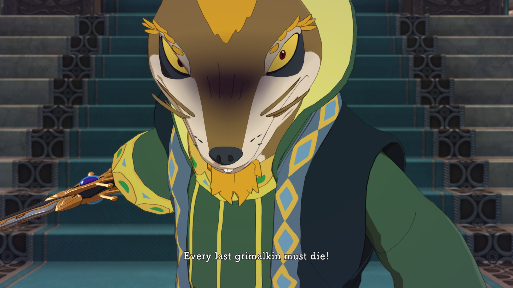
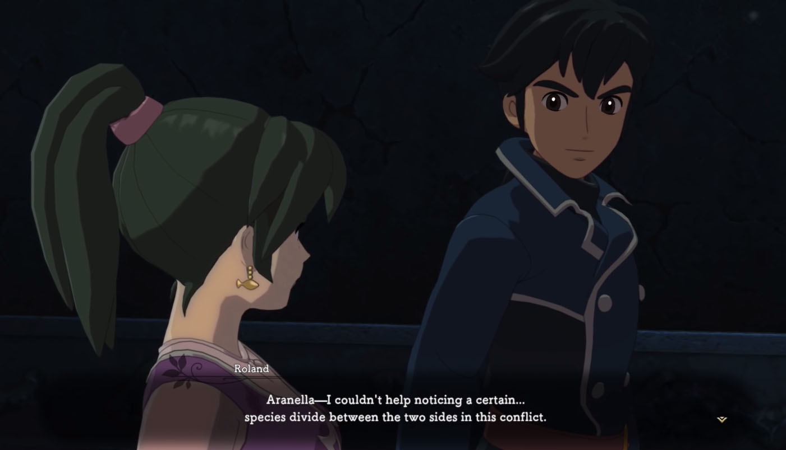
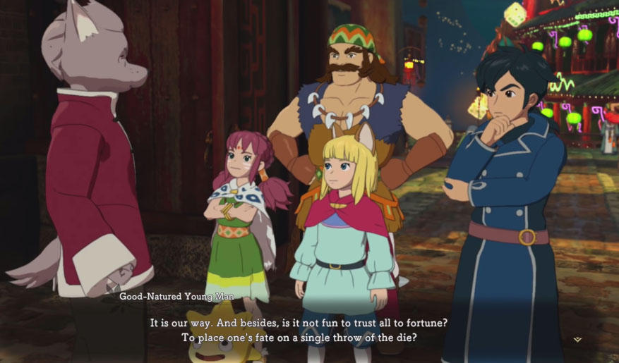
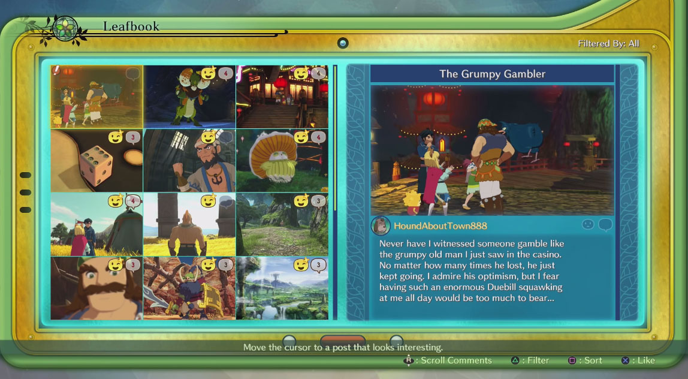
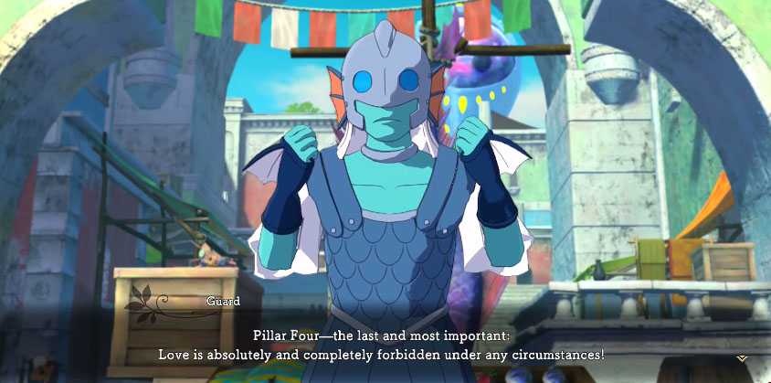
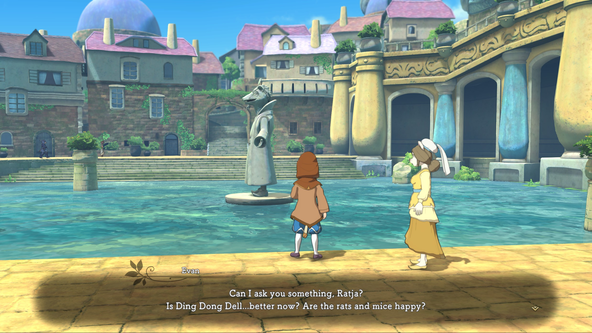
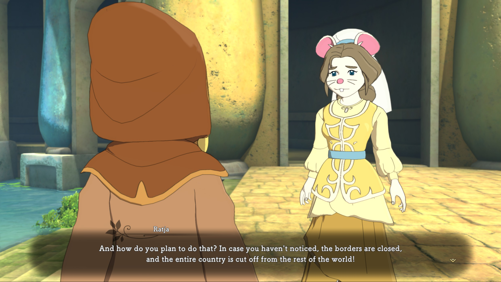
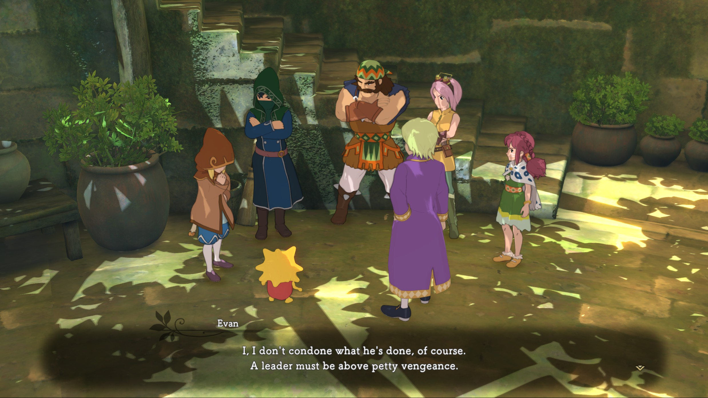

I was longing for something to smash my spare time on when I saw one of my favourite youtubers playing an interesting new video game. I was sold immediately. It's called _Ni no Kuni 2: Revenant Kingdom_. Interesting name aside, the game's "art director" is none other than Studio Ghibli, and it shows. Fans of Ghibli's films recognize the art style immediately. The score is also composed by Ghibli-regular Joe Hisaishi.

I never played the previous game as I didn't have the right consoles, so I was quite excited to learn that this one was available on Steam. I shelled out the salty 60€ for the game and set out on an adventure that would end up lasting for over 40 hours and giving me a lot of food for thought.

What I'm about to explore is basically this: if you were a Japanese _salaryman_ game designer and just took a snapshot of recent news and the apparent _zeitgeist_, what kind of world would you think we lived in? What kind of fairy tale would you tell? What would Walt Disney do? What kind of morals would you expect them to teach your children?

The sequel's market was shifted further towards a western audience, but stayed in a sweet spot reserved for an audience aware of "anime" and "ghibli". Typically Japanese action role-playing games just do their Japan-crazy as usual and the west just learns to like some particular game due to the stars being aligned for once. But this time, they did their market research a bit... well, we'll see. Let's put it this way: the world is much more scarier on paper compared to living in it. Try reading the news for a while and pretend you're reading the news of a distant country. Your local news become immediately so asinine you wouldn't believe.

Before I embark on my adventure of curious observations, needless to say this post will **SPOIL the entire story of the game**. If you're not into action-adventure role-playing games, read on and enjoy a hearty guffaw. But if there's a chance that you, dear reader, might enjoy the game, google it up first and see if makes you feel fuzzy inside (and have 40 hours to spend). If so, buy it and enjoy it with a pair of blue eyes.

<inline-image>
    
    <figcaption>Genocide, am I right?!!</figcaption>
</inline-image>

## It's pre-emptive self-defense, not murder

The phrase _ni no kuni_ means literally "another world" and unsurprisingly proposes a very ghibliesque setting: there is the real world and a magical world alongside it. A protagonist gets sucked into this magic edition and shenanigans happen

The game's designers said in an interview that this time around they wanted to introduce an older character to attract a slightly more mature audience. That's pretty easy, considering the previous games' characters were mostly about 6 years old. The older character they introduced is Roland. Roland was the president of a country in the real world. The main protagonist is not Roland however, but Evan, a half-**cat** boy-king, of all things.

The game begins and immediately things turn sour. The main antagonist Mausinger – the king's advisor – is introduced. Mausinger stages a coup and a lot of people get killed. Evan needs to stop boohoo-ing that all his friends are dead to create a new kingdom where everyone can live _happily ever after_. Roland the experienced statesman to the rescue! The game hasn't even properly begun when the player is introduced to the theme of the game: the prime evil, racism. For some reason, most of the world's nations' leaders have been infected by an evil force which causes their behavior to change, typically towards hatefulness and selfishness.

<inline-image>
    
    <figcaption>Who let you out of the gulag?</figcaption>
</inline-image>

This isn't very uncommon, though. Throughout history a lot of fairy tales, Disney films and others have had a similar theme: social classes and races of citizens were portrayed by various animal species and the species were clearly animated in such a way that it was obvious who the good and bad guys were. What **was** surprising how direct the game was with the subject. The way it was presented felt very... topical. The message was pretty clear: in spite of Evan's moronic optimism, weak self-help quotes like _"justice always prevails"_ are false, and violence dictates the destiny of Ni no Kuni, just as it does in the real world. Roland and Evan must learn to swing a sword and the _action role-playing game_ genre has once again justified itself. Let's go!

## The lunacy of religion

Searching for answers and allies, Evan and Roland eventually arrive at the superstitious nation of Goldpaw, the country of the dogfolk. The dogs are completely insane: any state affair must involve a divine intervention. The dogs have a divine statue which is able to roll a die. The roll of the divine die decides everything from tax rates to criminal court hearings. All the dogs are in on it and believe fully in the justice of the die. Questioning the sanity of the divine die makes the dogs suspicious of the open-minded young king's adventurous troupe. Sound familiar?

<inline-image>
    
    <figcaption>Outsourcing responsibility to imaginary things! Never heard that before.</figcaption>
</inline-image>

It gets better: the dogs have a charismatic leader, obviously! A priest-like ugly pug who presents himself as a humble servant of the dice roll. It's obvious to the player that it's just a mechanism to control the sheep, but the leader, as it turns out, wasn't entirely to blame here. He was forced into it, like a cornered politician. Pretty meta! The dogs built giant factories which manufacture fake dice with built-in mechanisms for the country's casinos and offices to manipulate everything. Again, a quite scoobydooesque plot but something in its design stamped a giant Cheshire grin on my face. I was liking the game immensely. God bless our freedom to believe what we choose to believe.

Evan and pals rid Goldpaw of this cancer and suddenly many of the citizens gain a shed of rationality, especially after expressing their interest in joining Evan's new kingdom of totally no internal issues. Immigration offices of the world: take note!

## Leafbook

This was such a great feature I'm frankly quite stunned why stuff like this doesn't play a part in games and films more often. Social media is not a phenomenon anymore – it's a normal part of our daily lives. I think the lack of social media in entertainment in general is partly due to its non-ambiguity: social media is tied to a product or brand, such as Facebook or Twitter. In order to use social media, you have to call it by name. Using an existing product would make you endorse it. Coming up with a new one would cause the audience not to recognize it. Cities: Skylines, the Simcity-done-right, had its Chirper. Chirper's purpose was to send "tweets" to the player to inform the player of citizens' daily woes and other topical things. It worked fantastically, although eventually the tweets started to repeat themselves as they were just hard coded messages based on triggered events. Machine learning experts: the video game industry needs you!

<inline-image>
    
    <figcaption>Check out these selfies bruh.</figcaption>
</inline-image>

Ni no Kuni 2 has Leafbook – an amalgamation of Facebook and Twitter where every post is an image with a caption. New posts appear systematically as the player progresses through the story. Non-player characters the player might have already met also comment on the images, gossiping and providing other details. The player is not able to post anything, but browsing posts gives the player hints on possible secrets and characters to recruit to Evan's kingdom. It's fairly passive and completely unnecessary for beating the game, but it's a fun and intuitive detail and offers treasure hunting players extra activities.

## Worship or suffer

Next stop on our adventure to societal failures is ideologically a bit further away but alive and well nonetheless. Turns out the fish people, merfolk, are ruled by fear. Fleeing their country is really difficult, outsiders are greeted by a military escort and the tyrant queen has decreed a bunch of ridiculous laws known as the Four Pillars. The Four Pillars forbid some obvious things, such as being sick and falling in love. The queen herself is a bit of a recluse – she hasn't shown herself to her subjects in years. This would have a _very_ strong smell of classic Disney if it weren't for the queen herself, who happens to be a bit of a "lick my foot" type of dominating weirdo. The loved queen isn't even merfolk, but human! I'm pretty sure I've heard of this place before, but I can't quite put my finger on it.

<inline-image>
    
    <figcaption>The Zora in Breath of the Wild had more fashion sense than these guys.</figcaption>
</inline-image>

The locals are fairly primitive and live in large ruined ancient Greek type of rickety structures and their ruler expresses her love in a quite indirect, inconspicuous way by observing the actions of citizens with a _huge_ eyeball tower (think Sauron's eye) which is able to detect every single action you make. Pleasant. Plot twist: in the end it was just the queen making sure the country is safe, because reasons. Again Evan & co save the day and a bunch of people want to move over to his country.

## Technommunism
Broadleaf, the makers of our Leafbook, is a nation focused on improving the world with magic-based technology. There is no royalty here – in a super-orwellian fashion the entire nation is one single company and the CEO acts as the president. As you'd expect, the CEO is under an influence and people are dying. All that matters is the completion of the latest product. Upon entering the city, Evan and friends are greeted with a workers strike. A proper rally with engineers and scientists yelling catchy war cries and waving edgy signs. People are dying in factories when workers' physical and mental health don't matter.

This time violence isn't enough to save the day. In addition to violence we need memories and compassion to banish the greed. If only the real world had lobbyists trying to install some kind of conscience to shareholders' heads. Maybe underpaid slave-like workers in countries with questionable morals could just slay some executives with a sword and be celebrated afterwards. It might work just as well.

## Building the wall
After a lot of weird encounters with the citizens of the world, it's time to go home – the old home where Mausinger now reigns. The kingdom was previously a kingdom of the grimalkin, cat-like humanoids. Now it's a kingdom for mice and rats, who in the beginning of the game were presented as the bad guys. Many grimalkin escaped but the ones who remain are treated as trash, guards punch them for sport and people spit on them. But then... shit starts to get real.

Evan and friends walk around town trying to learn the whereabouts of the grimalkin. Turns out they've been driven to the sewers, like unwanted immigrants. In disguise Evan talks to citizens of this new nation and learns the cold truth: _his old kingdom was an apartheid_, and he as the sheltered prince wasn't told about it. The mice are _free_ from centuries of oppression.

<inline-image>
    
    <figcaption>Lesson in politics: our happiness is not your happiness.</figcaption>
</inline-image>

The mice are happy! They are happy that they feel empowered. They are happy that they have a common enemy which they just recently beat. They revel in the intoxicating feeling of superiority... except the ones who were servants and allies of the murdered court.

Evan learns what it takes to make citizens happy:

1. Come up with enemies
2. Publicly display your strength to your citizens
3. Empower your own citizens with weapons, status or money

Anybody order a needless missile strike lately?

Evan had himself been doing these things all the time along the way, not quite understanding what it meant. I would have loved to hear Roland's comments on the state of things, him being an actual president and all. Oh, and one thing I forgot to mention: in the first 15 seconds of the game, in the game's opening cutscene, Roland's home country is destroyed in a nuclear strike. Let's fucking go.

<inline-image>
    
    <figcaption>I think the question was: "Could I make the kingdom great again?"</figcaption>
</inline-image>

## I lied
If you read this and _have_ played the game, you're probably wondering what the hell am I raving on about. These are really the main events of the story, excluding the final chapters. However, I left a critical piece out: what was it that caused the world's nations to go crazy like they did? This little detail kind of undoes most of what I just told. That detail is irrelevant, but it acts as a reality check. I remember as a child these stories were everywhere: something bad happens but then its always undone by cringy bullshit which would _never_ happen in real life, so why were these stories told? To raise stupider citizens? Without this unnamed cartoony antagonist the game would basically be a horror game. If it wasn't for this little detail, the shiny-ass Ghibli art style, and the protagonists' sanity-defying naive optimism, most of the game's script could just as well be written by Nietzsche.

But what if! What if our world is plagued by a similar insanity and it can all be cured with a simple concept, but no one has ever come across it. There's a malicious power keeping us from achieving peace. Roland had his ride so help us out, Evan. Maybe it's your turn to hop over to our side and rustle a jimmy. Wake us up from this world of distasteful, untrustworthy and egotistic people.

What do you think? If our world could change one thing which would fix everything, what would it be?

<inline-image>
    
    <figcaption>Are you sure? We have a lot of leaders in here Roland's world who could take that advice – politics aside.</figcaption>
</inline-image>

