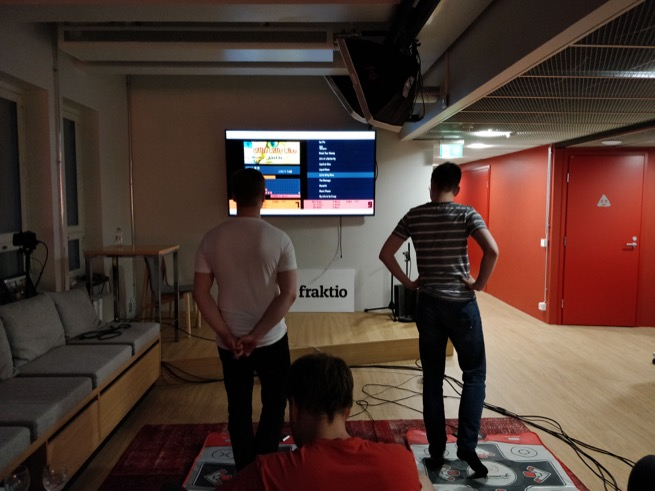

I don't have any photos of anyone in my home as family was never very significant, but I _have_ been blessed with delightful friends and colleagues who make life worthwhile. I am that obnoxious dude at the other end of the table taking those awkward photos, making people cringe in unison. Something to remember these special moments by.

# May

<figure>
    
    <figcaption>There can never be enough hats at the office.</figcaption>
</figure>

<figure>
    
    <figcaption>Our latest intern being useful.</figcaption>
</figure>

<figure>
    
    <figcaption>After the disappointment of summer 2017, sunshine felt like a finite resource.</figcaption>
</figure>

<figure>
    
    <figcaption>11pm. Visiting the office after a long night out and... suddenly a dance party!</figcaption>
</figure>

<figure>
    
    <figcaption>Penthouse patio gets its floorboarding and a bunch of tables! On the left an aeroponic herb cultivation system.</figcaption>
</figure>

# June

<figure>
    
    <figcaption>Meeting up with some ex-colleagues – both in the audience and in the band! Backstages of garage bands are endearing.</figcaption>
</figure>

<figure>
    
    <figcaption>11pm. Phone's camera doesn't do this sunset any justice.</figcaption>
</figure>

<figure>
    
    <figcaption>Impromptu swag promotion. </figcaption>
</figure>

The other side of the camera for the above: https://www.instagram.com/p/BkShBqFH0i2

<figure>
    
    <figcaption>A router died. A larvae in its natural habitat.</figcaption>
</figure>
<figure>
    
    <figcaption>Tuska Open Air! This "Satan Bus" is operated by... an ex-colleague's band's guitarists' brother... I think? Close enough.</figcaption>
</figure>

<figure>
    
    <figcaption>Gosh durnit <3</figcaption>
</figure>
<figure>
    
    <figcaption>The Satan Bus is a Tardis. Much larger inside than outside. </figcaption>
</figure>

<figure>
    
    <figcaption>The Satan Bus had a sauna in the back (wood stove).</figcaption>
</figure>

# July

<figure>
    
    <figcaption>Refactoring them palm trees.</figcaption>
</figure>
<figure>
    
    <figcaption>Before this night I had no idea what "sous vide" was. I felt like an anime character who gets name dropped some special fighting move's name and you're like "huh?"</figcaption>
</figure>
<figure>
    
    <figcaption>A stick is sousing the vide!</figcaption>
</figure>
<figure>
    
    <figcaption>Then it was finally time for a good ol' rölö.</figcaption>
</figure>

In the likely event of you not knowing what _rölö_ is, let [this horse](//i.imgur.com/VllER.png) explain. I guess we could translate rölö as "shit's going to escalate soon."

<figure>
    
    <figcaption>And the rölö ends with a minty twilight.</figcaption>
</figure>

<figure>
    
    <figcaption>One long wait comes to an end. This game makes me so happy. Modern pseudo-retro games are by far my favourites right now.</figcaption>
</figure>

<figure>
    
    <figcaption>A month of football comes to an end. Amazing tournament! Moar plz.</figcaption>
</figure>

<figure>
    
    <figcaption>I tried out some fat-ass enchiladas! 1½ of these is a good enough lunch.</figcaption>
</figure>

I haven't posted anything in the _kitchen_ series in a while. Maybe I'll think of something for my next post. Summer is not over and the forecast tells me the finite resource known as sunshine is not depleting quite yet – maybe I'll have enough material for a part two. Anyway, thank you for reading!

<!--
<figure>
    
    <figcaption>First, find the sunniest terrace in the city. Second, strategically position yourself into a mild shadow.</figcaption>
</figure>
-->
