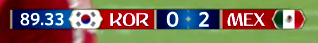

The UI Singularity

For a media engineering nerd like me, one of the greatest productions on the planet is the World Cup currently on-going in Russia. The camera work and all the real-time stuff they produce is mind-blowing. This year, during the tournament they have been showing a bunch of nostalgic inserts from ye olden days and a colleague was ranting about how horrible the computer-genearated graphics looked, early 2000s I assume.

I am great fan of old visualizations. More specifically the timer displays and scoreboards and such. These are a fascinating mirror to the spirit and visual style of the time period of the recording. In the early 2000s everything had to be round or elliptical and any square shapes _must_ have at least rounded corners. Trying to force rounded corners in "responsive" websites using table-layouts was literal horror, but once you got it working (and background images properly sliced), holy fuck was it cool.

## Try it yourself

I remember well how the style of the 2002 World Cup was cool as hell and nothing can possibly be more awesome. Of course, it was only a year or two when it felt outdated already so here's a challenge for you: try to guess what is the _next_ graphical style or visual movement which would replace the current one.

<figure>
    
    <figcaption>The game timer for 2018</figcaption>
</figure>

Mä fanitan näitä! Etenkin planssit ja infografiikka joka noudattaa ajan henkeä. 2000-luvun alussa kaiken piti olla pyöreää/soikeaa ja muistan kuinka 2002 kisojen kamat olivat _ihan vitun cool:_ tästä ei siistimmäksi mennä. Nyt yritän veikkailla että minkähän lookin tieltä nykypäivän kamat väistyvät, vai väistyvätkö. Kutsun UI-singulariteetiksi hetkeä jonka jälkeen aikakautta ei enää pysty plansseista tunnistamaan. Suurempi tekijä alkaa olemaan muut jutut esim esitystekniikka ja kuvanlaatu
