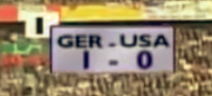

For a media tech nerd like me, one of the greatest geek-outs is the World Cup currently on-going in Russia. The camera work and all the real-time stuff they produce is mind-blowing. This year, during the tournament they have been showing a bunch of nostalgic inserts from ye olden days and a colleague was ranting about how horrible the old visuals or computer-genearated graphics looked.

I'm a great fan of the real time parts such as timer displays and scoreboards and such. They are a fascinating mirror to the spirit and visual style of the time period of the recording. For example, in the 2000s everything had to be round or elliptical and any square shapes _must_ have rounded corners. Meanwhile I was trying to force rounded corners on websites using table-layouts which was nasty business, but once you got it working (and background images properly sliced), holy fuck was it cool. It was done becase _you could_, not because it made any visual sense. Then again, that was the reasoning for many things back then.

## Try it yourself

The style of the 2002 World Cup was cool as hell and nothing could possibly be more awesome. Of course, it was only a year or two later when it felt outdated already. Here's an excercise for you. Below is a capture of a scoreboard from some time ago. Could you guess when was this game played?

<figure>
    
    <figcaption>Guess!!</figcaption>
</figure>

Several things come to mind:

1.  It's primitive and feels like a physical board being filmed, which it might well be for all I know.
2.  The large I in the corner is the period indicator. It's a bit hidden behind the scores trying to be _cool_ but not yet cool enough to have rounded corners.
3.  The image itself is somewhat vibrant and clearer than what you would have in the 80s.

90s it is then! Or to be precise, the 1998 World Cup in Brazil. That's easy. So here's a challenge for you: try to guess what would the _next_ graphical style or visual movement look like? How would you know? Below is a reference from today.

## The Design Singularity

As it happens, people living _in_ an era don't know the distinctive features of their time, but I can take an entirely uneducated recreational guess! In my opinion, the main _variable_ of today is the wilful submission to algorithmically curated social media and the endless feed of visual irritant. That's a mouthful... but does design care? There is so much stuff online! So much that in fact production speed is more important than quality and in many cases the art we consume has degraded.

<figure>
    
    <figcaption>The game timer for 2018</figcaption>
</figure>

_What matters is the material you are exposed to the most._ A professional carefully creates a video for people to enjoy. The video is great and makes people happy for a couple of minutes. Then I record something from a phone and use a cheap app to insert static text on top of the video to provide exposition. The end result horrifying, but making it took a hundredth of the time spent making the professional, and what's better - it took no skill to make. I have become the catalyst of gilded shit and a true child of our time. Lately, academia has become concerned that entire generations might lose their identities and memories when web services of their childhoods eventually shut down, but I digress – _that_ is a story for another time.

We're living in a time where everyone is an expert and the minds of the masses are merely a transit for the information used to create even more addictive irritant in one digital form or another. **Visual trends have become a non-concern** as design solutions no longer have boundaries which previously were imposed by techincal limitations.

What I'm saying is this: I don't think we can recognize stilistic era-specific nuances in a purely graphical sense anymore. The winds changing the digital footprint are not driven by any coherent force we can identify today, but I _do_ believe there are other factors which would give it away, such as screen resolution and other display mechanics. This is what I call the UI or **design singularity**: when you no longer know. Objects always stay the same age and only you become older. I don't think we're quite there yet.

## Futurism!

I asked some friends what they thought of this and one thing came up – image quality still has some way to go. Not that anyone strongly asks for it, but it will be improving because it can be improved. CONTD
