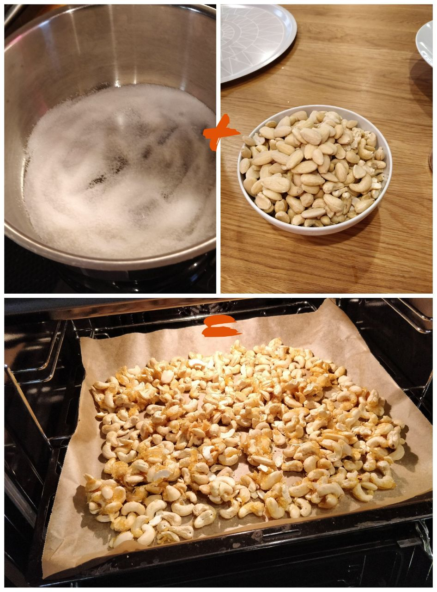

Everyone seems to like it so here it is: the magical recipe for my toasted cashews. It's a mix of a couple of recipes I found on the interweb which I can no longer find, but my version lives! It's very simple but the timing is very important. 

## You'll need

- Cashew nuts (500 g)
- Maybe other hard nuts like almonds. Don't use peanuts.
- A cup of sugar
- A little bit of runny honey
- Almond powder
- Chili-garlic-salt spice (powder), store-bought or self made

Have all these ready before you begin:

- A large pot
- A baking tray with parchment
- Some bowl for having the all nuts at the ready
- A wooden spatula (hard material, not bendy)
- Start heating the oven to 150 degrees celsius.

## The Spice

The Spice is a strong chili salt with a garlic touch. I'm using a store-bought one (Poppamies Vampyyrisuola) but you can try making your own.

Get a large bag (~3 litre) and mix 2 cups of almond powder and some of your Spice. Add more Spice until the mixture is very strong but soft enough to not be annoying.

## Do this

Heat the pot on a stove on medium-high and pour all of the sugar in the pot and wait. Be careful not to have the stove on too high temperature – it's very easy to accidentally burn the sugar.

When the sugar begins to melt, quickly add a spoonful of honey and stir. _Immediately_ when 95% of the sugar has melted and the sugar feels like it doesn't get any more viscous, add all the nuts into the pot, turn the stove off and "stir" furiously. You want all of the nuts to have a little bit of sugar-honey mixture on them. This is where you need a strong wooden spatula – as the sugar hardens and the nuts stick together, plastic ones will bend or break.

Once you have a satisfying semisolid chunk of slimy nuts, spread them on the baking tray. Try to lay them out as evenly as you can. You will not succeed, but try anyway. Then send the slimy nuts to the oven.

<figure>
    
    <figcaption>Sugar plus nuts equals tray in oven.</figcaption>
</figure>

In 10-15 minutes some of the nuts begin to have a darker tint to them. That is your sign to take them out. _Don't touch the nuts with your bare hands immediately after._ The sugar is very hot and will stick to your fingers and will just burn your soul while you scream. 

Your goal is to separate all the nuts from each other in as high temperature as possible without burning your hands. If the nuts get to room temperature, the Spice mixture will not stick and your nuts will be lame. 

- If you have some comfortable heat resistant kitchen gloves – great!
- If not, let the nuts cool down on the tray for ~15 minutes, and _carefully_ try out the temperature with your hands while having cold water ready for your hands if they are still too hot. 

Once the nuts are separated, send them all into the bag with the Spice and shake! Filter the nuts with a sieve, let them cool to room temperature and serve. Sprinkle some Spice on top of your serving.

 

